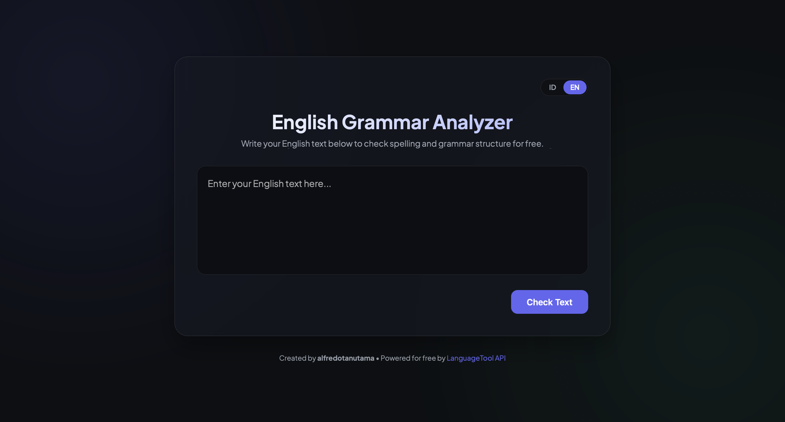

# Simple Grammar Checker

A lightweight, instant, and high-performance English grammar and spelling analyzer. Built as a single-page application with a premium, glassmorphic dark-theme UI.

## 🚀 Demo / Preview

<!-- Replace the placeholder below with a screenshot of your app -->


## ✨ Features

- **Instant Check**: Submits text and highlights spelling, grammatical errors, and stylistic issues instantly.
- **Contextual Suggestions**: Shows clear descriptions for errors and suggests replacements.
- **Smart "Fix All"**: Applies first-choice recommendations to all errors with a single click.
- **Bilingual UI Interface**: Easily switch the application interface between **Bahasa Indonesia** and **English** dynamically without page reloads.
- **Free & Secure**: Powered by the public LanguageTool API, requiring no API registration, keys, or complex server setup.
- **Premium Aesthetics**: Crafted using a modern dark palette, Plus Jakarta Sans typography, and smooth, responsive interactive micro-animations.

## 🛠️ How to Use

### 1. Locally (Simple Web Browser)
Since this is a fully client-side static application, you can simply clone this repository and double-click the `grammar_checker.html` file to run it in your preferred browser.

### 2. Via Local Server (e.g., Python)
If you prefer running it through a local HTTP server:
```bash
# Navigate to the project folder
cd free-grammar-check

# Run local server
python3 -m http.server 8000
```
Then open your browser and visit: `http://localhost:8000/grammar_checker.html`.

## ⚙️ How It Works

This project communicates directly with the **LanguageTool API** (locked to the `en-US` language code) via standard fetch requests. All processing is done securely in real-time, sending the text and returning parsed suggestions with character offset mappings.

## 👤 Author

Created by [alfredotanutama](https://github.com/alfredotanutama).

## 📄 License

This project is licensed under the MIT License.
